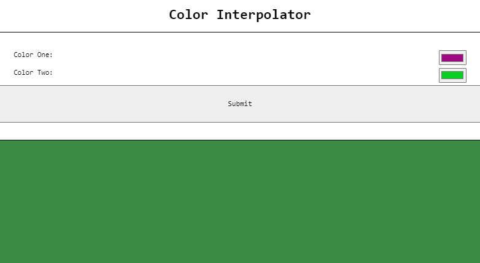
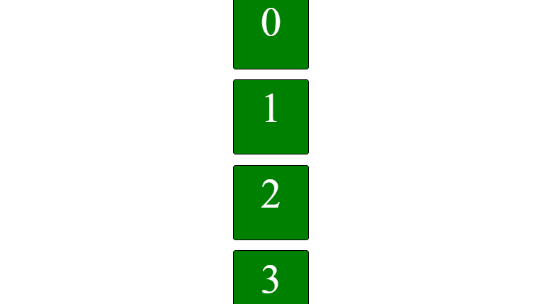

# Toolkit
Need a description here...

This is **bold** and this is _italic_.
<br>
<br>

# JavaScript

## Color Interpolator

Choose two colors and interpolate between them.


<br>


Link to [CodePen](https://codepen.io/jon424/pen/mdRbbYQ) example.

</details>
</details>

<br>
<details>
<summary markdown="span">HTML</summary>

```html
<h1>Color Interpolator</h1>
<form name='colors'>
  <label>Color One:<input type='color' name='color1' value='#079f23' /></label>
  <label>Color Two:<input type='color' name='color2' value='#07d023' /></label>
  <input type='submit' value='Submit' />
  <div id='test'></div>
</form>

```
</details>

<br>
<details>
<summary markdown="span">CSS</summary>

```css
body,
body * {
  font-family: monospace;
  box-sizing: border-box;
}
h1 {
  text-align: center;
}
#test {
  width: 100%;
  min-height: 300px;
  border: solid 1px #000;
  margin: 2rem auto 0rem auto;
  float: none;
}
form[name="colors"] {
  float: none;
  margin: auto;
  width: 50%;
  padding: 1rem;
  border: 1px solid black;
}
label {
  display: block;
  margin: 1rem auto;
  width: 80%;
  float: none;
}
label > input {
  float: right;
}
input[type="submit"] {
  padding: 1.5rem;
  width: 100%;
}


```
</details>

<br>
<details>
<summary markdown="span">JavaScript</summary>

```js
document.addEventListener("DOMContentLoaded", () => {
  let c1 = document.forms.colors.color1;
  let c2 = document.forms.colors.color2;
  let div = document.getElementById("test");
  let pointer = 0;
  let range = [];

  let tx = NaN; // keep a record of the timer so it can be cancelled before starting a new one

  const getColorValues = (e) => {
    e.preventDefault();
    return [hexToRgb(c1.value), hexToRgb(c2.value)];
  };

  const hexToRgb = (hex) => {
    let c;
    if (/^#([A-Fa-f0-9]{3}){1,2}$/.test(hex)) {
      c = hex.substring(1).split("");
      if (c.length == 3) c = [c[0], c[0], c[1], c[1], c[2], c[2]];
      c = "0x" + c.join("");

      // Set the return value as an Object
      return {
        r: (c >> 16) & 255,
        g: (c >> 8) & 255,
        b: c & 255,
      };
    }
    throw new Error("Bad Hex");
  };

  const GColor = (r, g, b) => {
    r = typeof r === "undefined" ? 0 : r;
    g = typeof g === "undefined" ? 0 : g;
    b = typeof b === "undefined" ? 0 : b;
    return { r: r, g: g, b: b };
  };

  const createColorRange = (c1, c2) => {
    let colorList = [],
      tmp;
    for (let i = 0; i < 255; i++) {
      tmp = GColor();
      tmp.r = c1.r + (i * (c2.r - c1.r)) / 255;
      tmp.g = c1.g + (i * (c2.g - c1.g)) / 255;
      tmp.b = c1.b + (i * (c2.b - c1.b)) / 255;
      colorList.push(tmp);
    }
    return colorList.concat(colorList.slice().reverse());
  };

  const rotateColors = () => {
    let obj = range[pointer];
    div.style.backgroundColor =
      "rgb( " + obj.r + ", " + obj.g + ", " + obj.b + " )";
    pointer++;

    if (pointer === range.length) pointer = 0;
    tx = window.setTimeout(rotateColors, 10);
  };

  document.forms.colors
    .querySelector('[type="submit"]')
    .addEventListener("click", (event) => {
      if (!isNaN(tx)) clearTimeout(tx); //clear any timeouts that arerunning before starting another one
      const [startColor, endColor] = getColorValues(event);
      range = createColorRange(startColor, endColor);

      rotateColors();
    });
});

```
</details>
</details>
<br>
<br>
<hr>


## Intersection Observer Example

Using JavaScript's [Intersection Observer API](https://developer.mozilla.org/en-US/docs/Web/API/Intersection_Observer_API);


<br>


Link to [CodePen](https://codepen.io/jon424/pen/NWwReEJ?editors=1111) example.

</details>
</details>

<br>
<details>
<summary markdown="span">HTML</summary>

```html
   <div class="container">
      <div class="box">0</div>
    </div>

```
</details>

<br>
<details>
<summary markdown="span">CSS</summary>

```css
 .container {
      display: flex;
      flex-direction: column;
      gap: 1rem;
      align-items: flex-start;
    
    }

    .box {
      background: green;
      color: white;
      font-size: 4rem;
      text-align: center;
      margin: auto;
      height: 100px;
      width: 100px;
      border: 1px solid black;
      border-radius: 0.25rem;
      padding: 0.5rem;
      transform: translateX(100px);
      opacity: 0;
      transition: 150ms;
    }

    .box.show {
      transform: translateX(0);
      opacity: 1;
    }

    .box.more {
      background-color: orange;
    }

```
</details>

<br>
<details>
<summary markdown="span">JavaScript</summary>

```js
 const boxes = document.querySelectorAll(".box");
    const observer = new IntersectionObserver(
      (entries) => {
        entries.forEach((entry) => {
          entry.target.classList.toggle("show", entry.isIntersecting);
          if (entry.isIntersecting) observer.unobserve(entry.target);
        });
      },
      {
        threshold: 1,
      }
    );

    const lastBoxObserver = new IntersectionObserver((entries) => {
      const lastBox = entries[0];
      if (!lastBox.isIntersecting) return;
      loadNewBoxes();
      lastBoxObserver.unobserve(lastBox.target);
      lastBoxObserver.observe(document.querySelector(".box:last-child"));
    }, {});

    lastBoxObserver.observe(document.querySelector(".box:last-child"));

    boxes.forEach((box) => {
      observer.observe(box);
    });

    const boxContainer = document.querySelector(".container");

    function loadNewBoxes() {
      for (let i = 0; i < 1000; i++) {
        const box = document.createElement("div");
        box.textContent = `${i + 1}`;
        box.classList.add("box");
        observer.observe(box);
        boxContainer.appendChild(box);
      }
    }

```
</details>
</details>
<br>
<br>
<hr>

## Preload Images

Preload images in browser for optimized performance.


Link to [CodePen](https://codepen.io/jon424/pen/jOYewJy?editors=1111) example.

</details>
</details>

<br>
<details>
<summary markdown="span">HTML</summary>

```html
<div id="body">
</div>
```
</details>

<br>
<details>
<summary markdown="span">JavaScript</summary>

```js
const preloadImages = (urls) => {
    const preloadImage = (url) => {
        const img = new Image();
        img.src = url;
        img.style.display = 'none';
    };
    urls.forEach(url => preloadImage(url));
}

const urlCollection = [
    "https://picsum.photos/id/237/200/300", "https://picsum.photos/id/238/200/300", "https://picsum.photos/id/239/200/300", "https://picsum.photos/id/240/200/300"
];

preloadImages([...urlCollection]);

const images = [];
for (let i = 0; i < urlCollection.length; i++) {
    let image = document.createElement("img");
    image.src = urlCollection[i];
    images.push(image);
    document.body.append(image);
}
```
</details>
</details>
<br>
<br>
<hr>
here are some:

- list items
- more